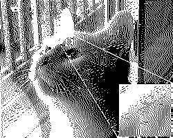

# Example of Dithering Not floats allowed

I did this all in fixed point so there are no floats allowed
I have a slight error where I really should widen than narrow
the data type of the images but than i copy 3 times which is less 
desirable. Its slightly harsh quantization error i'll have to try 
both ways

# Algos
 1) Flyod Steinberg
 1) Akinson

# Palettes 
 1) 1 bit color shown 
 1) GBA 
 1) Large palettle 30 colors alrightish
 1) purple palettle

# Input cat

# Output

